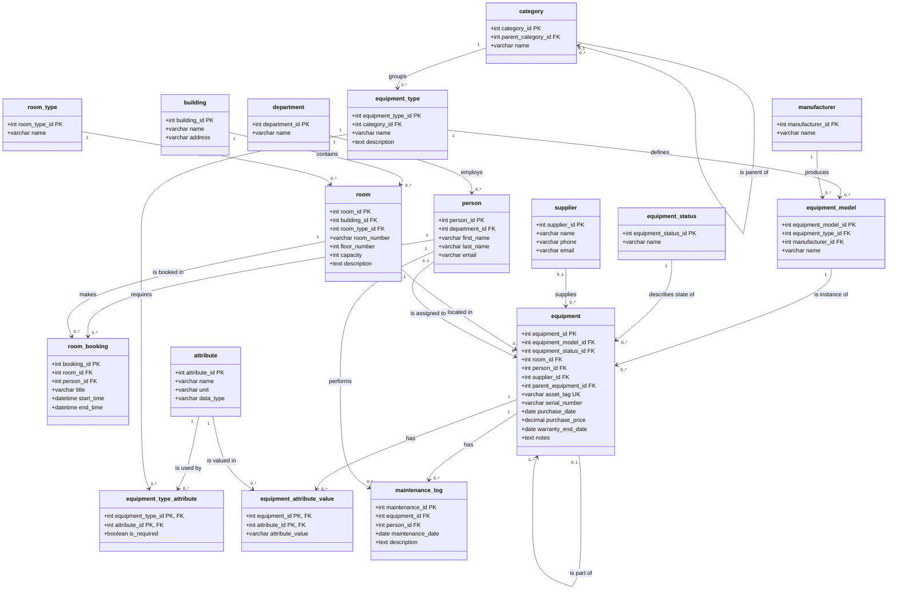

```mermaid
classDiagram
    class building {
        +int building_id PK
        +varchar name
        +varchar address
    }
    class room_type {
        +int room_type_id PK
        +varchar name
    }
    class room {
        +int room_id PK
        +int building_id FK
        +int room_type_id FK
        +varchar room_number
        +int floor_number
        +int capacity
        +text description
    }
    class department {
        +int department_id PK
        +varchar name
    }
    class person {
        +int person_id PK
        +int department_id FK
        +varchar first_name
        +varchar last_name
        +varchar email
    }
    class room_booking {
        +int booking_id PK
        +int room_id FK
        +int person_id FK
        +varchar title
        +datetime start_time
        +datetime end_time
    }
    class category {
        +int category_id PK
        +int parent_category_id FK
        +varchar name
    }
    class equipment_type {
        +int equipment_type_id PK
        +int category_id FK
        +varchar name
        +text description
    }
    class manufacturer {
        +int manufacturer_id PK
        +varchar name
    }
    class equipment_model {
        +int equipment_model_id PK
        +int equipment_type_id FK
        +int manufacturer_id FK
        +varchar name
    }
    class equipment_status {
        +int equipment_status_id PK
        +varchar name
    }
    class supplier {
        +int supplier_id PK
        +varchar name
        +varchar phone
        +varchar email
    }
    class equipment {
        +int equipment_id PK
        +int equipment_model_id FK
        +int equipment_status_id FK
        +int room_id FK
        +int person_id FK
        +int supplier_id FK
        +int parent_equipment_id FK
        +varchar asset_tag UK
        +varchar serial_number
        +date purchase_date
        +decimal purchase_price
        +date warranty_end_date
        +text notes
    }
    class attribute {
        +int attribute_id PK
        +varchar name
        +varchar unit
        +varchar data_type
    }
    class equipment_type_attribute {
        +int equipment_type_id PK, FK
        +int attribute_id PK, FK
        +boolean is_required
    }
    class equipment_attribute_value {
        +int equipment_id PK, FK
        +int attribute_id PK, FK
        +varchar attribute_value
    }
    class maintenance_log {
        +int maintenance_id PK
        +int equipment_id FK
        +int person_id FK
        +date maintenance_date
        +text description
    }

    building "1" --> "0..*" room : contains
    room_type "1" --> "0..*" room : classifies
    department "1" --> "0..*" person : employs
    person "1" --> "0..*" room_booking : makes
    room "1" --> "0..*" room_booking : is booked in

    category "0..1" --> "0..*" category : is parent of
    category "1" --> "0..*" equipment_type : groups
    equipment_type "1" --> "0..*" equipment_model : defines
    manufacturer "1" --> "0..*" equipment_model : produces

    equipment_model "1" --> "0..*" equipment : is instance of
    equipment_status "1" --> "0..*" equipment : describes state of
    supplier "0..1" --> "0..*" equipment : supplies
    room "0..1" --> "0..*" equipment : is located in
    person "0..1" --> "0..*" equipment : is assigned to
    equipment "0..1" --> "0..*" equipment : is part of
    equipment "1" --> "0..*" maintenance_log : has
    person "1" --> "0..*" maintenance_log : performs

    attribute "1" --> "0..*" equipment_type_attribute : is used by
    equipment_type "1" --> "0..*" equipment_type_attribute : requires
    equipment "1" --> "0..*" equipment_attribute_value : has
    attribute "1" --> "0..*" equipment_attribute_value : is valued in
```
